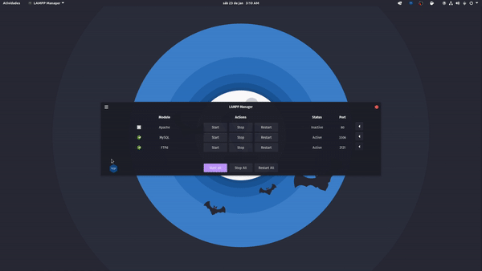
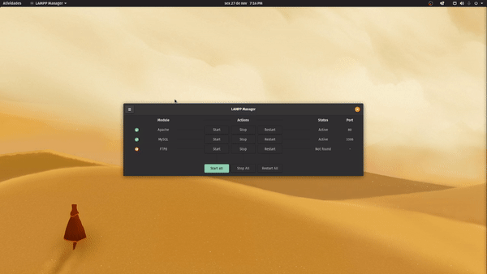
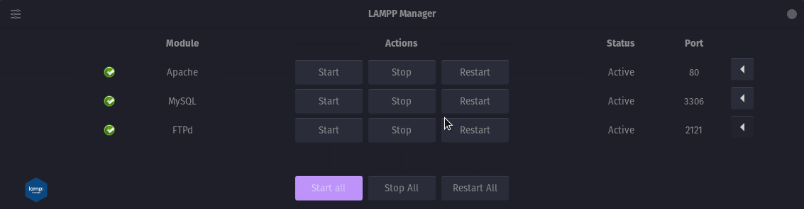
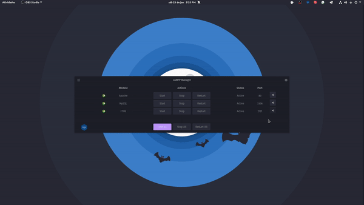
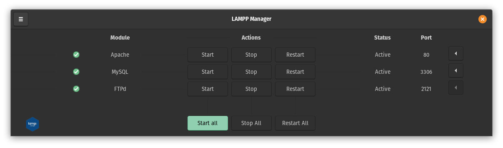
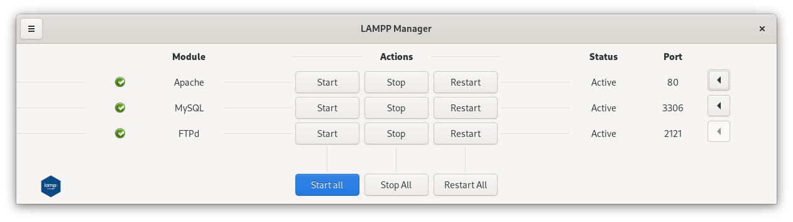
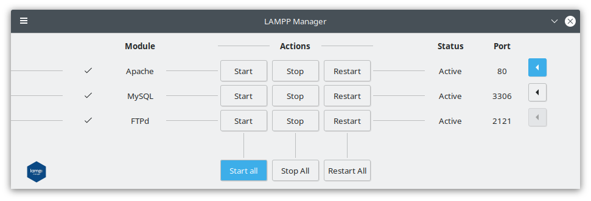

<h1 align="center">
  <br>
  <a></a>
  <br>
  LAMPP Manager
  <br>
</h1>


<h2 align="center" >
    A great way to Manager and install LAMPP services <br>
    
    
    <a href="https://github.com/CleoMenezes/LAMPP-Manager/releases/tag/v0.0.4">
    </a>
</h2>
<h1 align="center">



</h1>


# ⚈ About & How to use
Disclaimer: This project was created in order to facilitate the use of LAMPP. Before it was just a personal project to facilitate my day to day, but I decided to share it. Please enjoy and let me know any issues!

<p>
LAMPP Manager is a front end of LAMPP services where it will also have resources to facilitate day-to-day use, such as shortcuts to open the server directory, phpmyadmin and etc., and also to install LAMPP in an easy and intuitive way.
I created an interface as clean as possible, without distractions, where you can simply start Apache or stop MySQL or simply with one click stop or start all services.

Maybe for those who are used to doing everything for the Terminal they won't care much, but believe me, those who are starting in the Linux world sometimes just want to download a program that solves all of this in an easy and intuitive way.
</p>

<h4 align="center"> 
	🚧  Don't forget that it's still going on day by day...  🚧
</h4> 

<br>

# ⚈ How to get started
<p>
LAMPP Manager is now available in DEB and RPM.

### Deb installation
To install the deb version it is only necessary to download the file <a href="https://github.com/CleoMenezes/LAMPP-Manager/releases/">here</a>,install via your package installer probably just by opening the file. Install it as you normally do with any other program.

### Rpm installation
Our version in RPM is still experimental and was made through conversion by Alien but all the code was adapted to work in Fedora.
1. Download the RPM file <a href="https://github.com/CleoMenezes/LAMPP-Manager/releases/">here</a>
2. Install Alien: ```sudo yum install alien```
3. Go to the directory where the lampp-manager _ *. *. *. rpm file is and run ```alien -i lampp-manager _ *. *. *. rpm```

Install it as you normally do with any other program. When the installation is finished, no other process is necessary.

## Installation of LAMPP
After wasting a lot of time setting up a new environment and several times having problems with the installation of LAMPP, I tested several solutions and decided to create a simple script for installing and configuring the entire environment. LAMPP Manager.
I hope you enjoy your time programming.

To install or uninstall it you just need to access the menu button on the upper left, click on Install LAMPP and choose between the Install Now and Uninstall options. After that, a Terminal window will open asking for your root password in order to execute your script.
Remember, there are settings that must be manual such as configuring MySQL, Phpmyadmin and etc.

<br>

<h1 align="center">



</h1>
</p>


# ⚈ New Features
<p>

## Change port services

This was certainly the most requested feature. Now you can easily change the service port just by clicking on the corresponding button on the right side, choose the port, click on the Change button, confirm the change and that's it!
By default the FTP used is VSFPd, the port must still be changed manually.


<h1 align="center">



</h1>

## App indicator

We now have an indicator on the tray that runs in the background so you can access LAMPP Manager more easily. spoiler: in the future they will be able to turn services on and off through there.


## Notifications

In addition to showing the status and ports of the services, LAMPP Manager now notifies you when these changes occur.


## Shortcuts

Some shortcuts on the menu to facilitate the workflow.




<br>

# ⚈ Some Screenshots

<br>
<h1 align="center">
  <p align="center">Pop!_OS</p>
   <br>
  <p align="center">Fedora</p>
   <br>
  <p align="center">KDE Neon</p>
   <br>
</h1>


# ⚈ Tech Stack

The following tools were used in the construction of the project:

- [Python](https://www.python.org/)
- [GTK](https://www.gtk.org/)
- [Glade](https://glade.gnome.org/)
- [Bash](https://www.gnu.org/software/bash/)

<h1>⚈ Bugs</h1>
<p>
Please report any type of bug. Remember that this is an open source project and will evolve with everyone's help. :)
Make the Linux world a friendlier place.
</p>


## License

MIT

---

> LinkedIn [Cleo-menezes-jr](https://www.linkedin.com/in/cleo-menezes-jr/) &nbsp;&middot;&nbsp;
> GitHub [CleoMenezes](https://github.com/CleoMenezes) &nbsp;&middot;&nbsp;
> Twitter [@Menemezis](https://twitter.com/Menemezis) &nbsp;&middot;&nbsp;
> Instagram [@cleo.menemezes](https://www.instagram.com/cleo.menemezes/) &nbsp;&middot;&nbsp;
