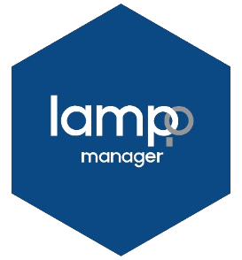
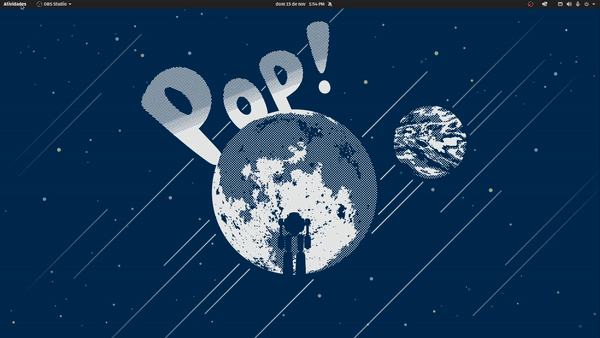
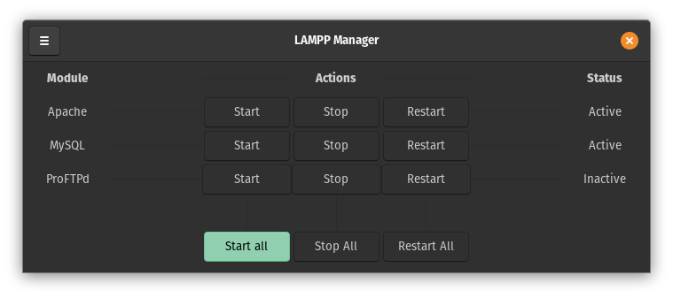
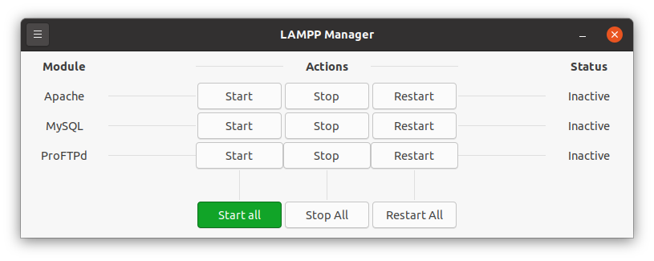
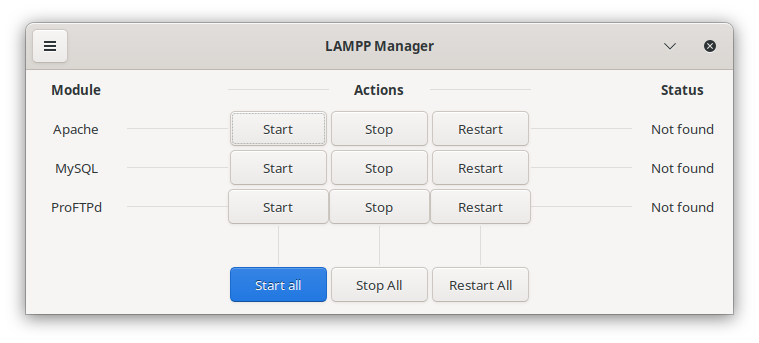

<h1 align="center">
   
  
   
  LAMPP Manager
   
</h1>

<h2 align="center" >
    A simple LAMPP manager designed to automate all the work  
    
    
    
</h2>
<h1 align="center">

</h1>

# ⚈ About & How to use
Disclaimer: This project was created in order to facilitate the use of LAMPP. Before it was just a personal project to facilitate my day to day, but I decided to share it. Please enjoy!

LAMPP Manager is nothing more than a front end for LAMPP / XAMPP where there will also be resources like opening the directory for the server, or installing LAMPP in an easy and intuitive way. I created an interface as clean as possible without distractions where you can simply start Apache or stop MySQL or simply with just one click stop or start LAMPP.

Maybe for those who are used to doing everything for the terminal, they don't care so much, but believe me, those who are starting in the Linux world sometimes just want to download a program that solves all of this in an easy and intuitive way.

<h4 align="center"> 
	🚧  Don't forget that it's still in progress...  🚧
</h4> 

 

# ⚈ How to get started

Download the deb version available here <a href="#">https://github.com/CleoMenezes/LAMPP-Manager/releases/tag/v0.0.1</a>), it is currently available only in deb. In the future I think about migrating to Flatpak. Install via your package installer probably just by opening the file. Install it as you normally do with any other program.
When the installation is finished, no other process is necessary.

When opening LAMPP Manager, a terminal will first appear asking for your root password. This is so that you can start and stop any service without being asked for a password between each action. Enter the password and minimize the terminal if you want.

## Installation of LAMPP
Although there is a Bitmani installer that could do this manually, I recommend using the script I prepared.
Several times I had problems both using Bitmani's XAMPP both by terminal and with LAMPP Manager. If you want to fully enjoy without headaches, use the installer found in the options tab.

 

## Some Screenshots

 
<h1 align="center">
  
Pop!_OS

    
  
Ubuntu

    
  
KDE Plasma

    
</h1>

# ⚈ Tech Stack

The following tools were used in the construction of the project:

- [Python](https://www.python.org/)
- [GTK](https://www.gtk.org/)
- [Glade](https://glade.gnome.org/)

<h1>⚈ Bugs</h1>

Please report any type of bug. Remember that this is an open source project and will evolve with everyone's help. :)
Make the Linux world a friendlier place.

## License

MIT

---

> LinkedIn [Cleo-menezes-jr](https://www.linkedin.com/in/cleo-menezes-jr/) &nbsp;&middot;&nbsp;
> GitHub [CleoMenezes](https://github.com/CleoMenezes) &nbsp;&middot;&nbsp;
> GitHub [@Menemezis](https://twitter.com/Menemezis) &nbsp;&middot;&nbsp;
